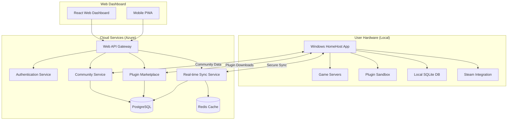
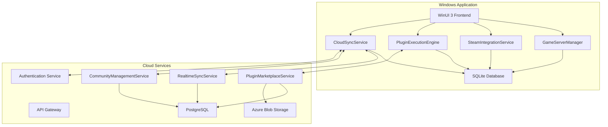
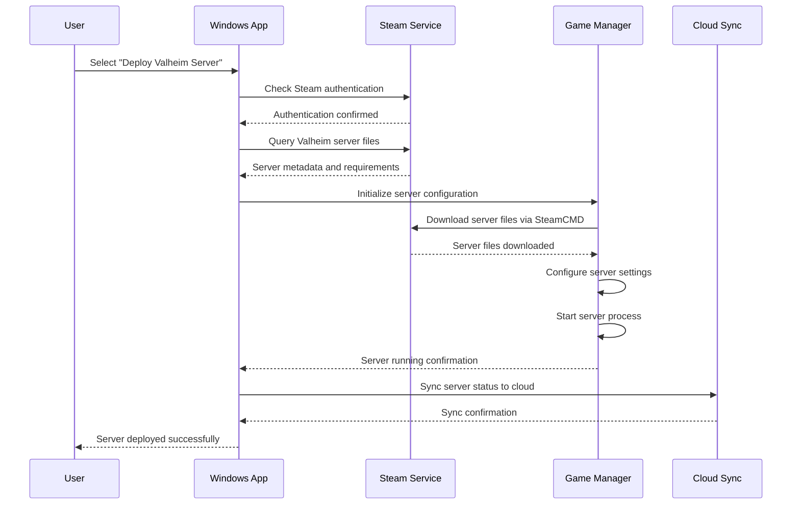
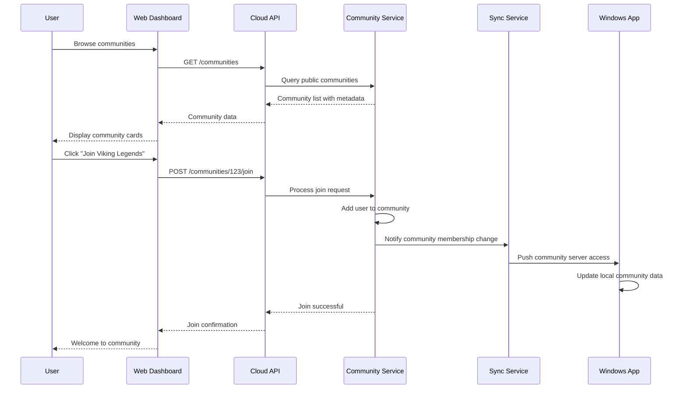
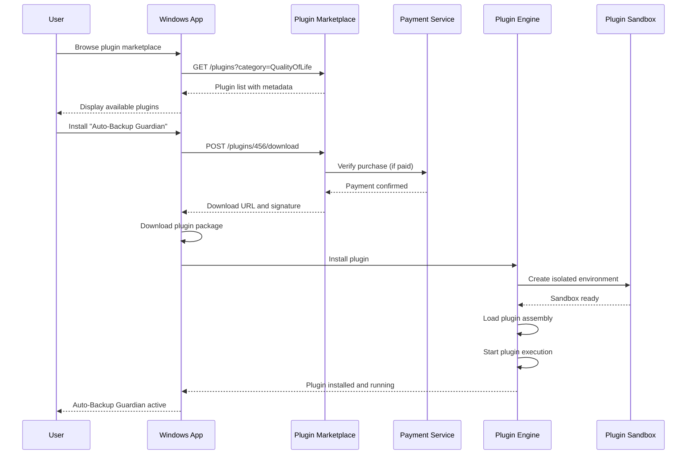

# HomeHost Fullstack Architecture Document

## Introduction

This document outlines the complete fullstack architecture for HomeHost, the revolutionary gaming hosting platform that combines local hardware control through a Windows application with cloud-connected community features via web dashboard. The architecture enables users to own their hosting infrastructure while participating in a thriving social gaming economy.

HomeHost's hybrid local-cloud approach creates a unique competitive advantage: users maintain complete control over their gaming servers through local Windows applications, while cloud services enable community discovery, cross-server player management, and monetization features that transform hosting from a cost center into a revenue opportunity.

### Starter Template or Existing Project

N/A - Greenfield project requiring custom architecture to support hybrid local-cloud deployment model with Windows application as primary engine and web services for community features.

### Change Log

| Date | Version | Description | Author |
| :--- | :------ | :---------- | :----- |
| Today | 1.0 | Initial fullstack architecture for Windows app + cloud services | Winston (Architect) |

## High Level Architecture

### Technical Summary

HomeHost employs a revolutionary hybrid local-cloud architecture where Windows applications serve as autonomous game server engines while cloud services provide community features, social discovery, and remote management capabilities. The Windows app handles all local server operations, Steam integration, and plugin execution, while cloud services manage community profiles, cross-server player relationships, and the plugin marketplace.

This architecture maximizes gaming performance through local processing while enabling social features and remote management through cloud connectivity. The design ensures users maintain complete control over their hardware and data while participating in a connected gaming community ecosystem.

### Platform and Infrastructure Choice

**Platform:** Hybrid Windows Native + Cloud Services Architecture
**Core Services:** 
- Windows WPF/WinUI application for local server management
- Azure cloud services for community features and web dashboard
- Real-time sync between local and cloud components
- Secure plugin execution environment

**Deployment Host and Regions:** 
- Windows applications deployed locally on user hardware
- Cloud services hosted on Azure with global CDN distribution
- Regional deployment for optimal latency (US East/West, EU West, Asia Pacific)

### Repository Structure

**Structure:** Monorepo with clear separation between Windows app and cloud services
**Monorepo Tool:** Nx workspace for unified build and dependency management
**Package Organization:** Platform-specific packages with shared TypeScript libraries

### High Level Architecture Diagram



### Architectural Patterns

- **Hybrid Local-Cloud:** Local Windows app for performance-critical operations, cloud services for social features and remote access
- **Event-Driven Sync:** Real-time synchronization between local installations and cloud services using SignalR and message queues
- **Plugin Architecture:** Secure sandboxed plugin execution with containerization for isolation and security
- **API Gateway Pattern:** Centralized authentication, rate limiting, and routing for all cloud service interactions
- **CQRS for Community Data:** Separate read/write models for optimal performance in community and player management operations

## Tech Stack

### Technology Stack Table

| Category | Technology | Version | Purpose | Rationale |
|:---------|:-----------|:--------|:--------|:----------|
| **Windows App Language** | C# | 12.0 | Native Windows application development | Excellent Windows integration, Steam SDK support, plugin hosting |
| **Windows App Framework** | WinUI 3 | 1.4.x | Modern Windows UI framework | Native performance, modern UI capabilities, touch support |
| **Game Integration** | SteamCMD | Latest | Steam game server management | Official Steam server deployment and update system |
| **Plugin Runtime** | .NET 8 | 8.0.x | Plugin execution environment | Secure sandboxing, performance, cross-plugin compatibility |
| **Local Database** | SQLite | 3.45.x | Local data storage | Embedded, reliable, no external dependencies |
| **Cloud Platform** | Azure | Latest | Cloud services hosting | Enterprise-grade, global scale, integrated services |
| **Backend Language** | C# | 12.0 | Cloud services development | Code sharing with Windows app, strong typing |
| **Backend Framework** | ASP.NET Core | 8.0.x | Web API and services | High performance, cloud-native, excellent tooling |
| **API Style** | REST + SignalR | 8.0.x | API communication and real-time sync | Standard REST for CRUD, SignalR for real-time updates |
| **Cloud Database** | PostgreSQL | 15.x | Community and marketplace data | ACID compliance, JSON support, Azure integration |
| **Cache** | Redis | 7.x | Session and performance caching | High-performance caching, pub/sub for real-time features |
| **Frontend Language** | TypeScript | 5.3.x | Type-safe web dashboard development | Strong typing, excellent tooling, code sharing |
| **Frontend Framework** | React | 18.x | Web dashboard UI framework | Component-based, excellent ecosystem, team expertise |
| **UI Component Library** | Tailwind CSS | 3.4.x | Responsive design system | Utility-first, customizable, rapid development |
| **State Management** | Zustand | 4.x | Global state management | Simple, performant, TypeScript-friendly |
| **Real-time Client** | SignalR Client | 8.0.x | Web dashboard real-time updates | Native integration with backend SignalR |
| **Authentication** | Azure AD B2C | Latest | User authentication and authorization | Enterprise security, social login, scalable |
| **File Storage** | Azure Blob Storage | Latest | Plugin files, game assets, backups | Scalable, CDN integration, cost-effective |
| **Build Tool** | .NET CLI + Vite | Latest | Build automation | Native .NET tooling, fast frontend builds |
| **Containerization** | Docker | Latest | Plugin sandboxing and cloud deployment | Security isolation, scalable deployment |
| **CI/CD** | Azure DevOps | Latest | Automated testing and deployment | Integrated with Azure, Windows app packaging |
| **Monitoring** | Application Insights | Latest | Performance and error tracking | Deep Azure integration, real-time monitoring |
| **Logging** | Serilog | 3.x | Structured logging | Flexible, performant, cloud-compatible |

## Data Models

### Core Data Models

### User

**Purpose:** Represents authenticated users across Windows app and web dashboard

**Key Attributes:**
- Id: Guid - Unique user identifier
- Email: string - Primary authentication email
- DisplayName: string - Public display name
- Role: enum - User permission level (Basic, Pro, Admin)
- CreatedAt: DateTime - Account creation timestamp
- LastSeen: DateTime - Last activity timestamp

**TypeScript Interface:**
```typescript
interface User {
  id: string;
  email: string;
  displayName: string;
  role: 'Basic' | 'Pro' | 'Admin';
  createdAt: Date;
  lastSeen: Date;
  profile: UserProfile;
  settings: UserSettings;
}

interface UserProfile {
  avatarUrl?: string;
  bio?: string;
  steamId?: string;
  discordId?: string;
  timezone: string;
}
```

**Relationships:**
- Owns multiple GameServers (1:n)
- Member of multiple Communities (n:m)
- Creates and manages Plugins (1:n)

### GameServer

**Purpose:** Represents individual game server instances managed by Windows app

**Key Attributes:**
- Id: Guid - Unique server identifier
- Name: string - User-defined server name
- GameType: enum - Supported game type
- Status: enum - Current operational status
- Configuration: JSON - Game-specific settings
- Performance: ServerMetrics - Real-time performance data

**TypeScript Interface:**
```typescript
interface GameServer {
  id: string;
  name: string;
  gameType: 'Valheim' | 'Rust' | 'CS2' | 'SevenDaysToDie' | 'MotorTown';
  status: 'Stopped' | 'Starting' | 'Running' | 'Stopping' | 'Error';
  configuration: GameConfiguration;
  performance: ServerMetrics;
  playerCount: number;
  maxPlayers: number;
  uptime: number;
  lastBackup: Date;
  ownerId: string;
  communityId?: string;
}

interface ServerMetrics {
  cpuUsage: number;
  memoryUsage: number;
  networkLatency: number;
  tickRate: number;
  lastUpdated: Date;
}
```

**Relationships:**
- Belongs to one User (n:1)
- Belongs to zero or one Community (n:1)
- Uses multiple Plugins (n:m)

### Community

**Purpose:** Represents gaming communities with multiple servers and cross-server features

**Key Attributes:**
- Id: Guid - Unique community identifier
- Name: string - Community display name
- Description: string - Community description
- IsPublic: boolean - Public discovery visibility
- MemberCount: number - Total community members
- Settings: CommunitySettings - Community configuration

**TypeScript Interface:**
```typescript
interface Community {
  id: string;
  name: string;
  description: string;
  logo?: string;
  banner?: string;
  isPublic: boolean;
  memberCount: number;
  settings: CommunitySettings;
  servers: GameServer[];
  admins: User[];
  createdAt: Date;
  tags: string[];
}

interface CommunitySettings {
  joinRequirement: 'Open' | 'Application' | 'InviteOnly';
  allowedGames: string[];
  moderationLevel: 'Relaxed' | 'Standard' | 'Strict';
  monetizationEnabled: boolean;
}
```

**Relationships:**
- Contains multiple GameServers (1:n)
- Has multiple User members (n:m)
- Generates revenue through CommunityRevenue (1:n)

### Plugin

**Purpose:** Represents installable extensions for game servers

**Key Attributes:**
- Id: Guid - Unique plugin identifier
- Name: string - Plugin display name
- Developer: User - Plugin creator
- Category: enum - Plugin category
- Price: decimal - Plugin cost (0 for free)
- Downloads: number - Total download count

**TypeScript Interface:**
```typescript
interface Plugin {
  id: string;
  name: string;
  description: string;
  version: string;
  developer: User;
  category: 'QualityOfLife' | 'AdminTools' | 'Community' | 'GameSpecific';
  price: number;
  downloads: number;
  rating: number;
  reviewCount: number;
  supportedGames: string[];
  isVerified: boolean;
  packageUrl: string;
  installationGuide: string;
}
```

**Relationships:**
- Created by one User (n:1)
- Installed on multiple GameServers (n:m)
- Generates revenue through PluginRevenue (1:n)

## REST API Spec

```yaml
openapi: 3.0.0
info:
  title: HomeHost Cloud API
  version: 1.0.0
  description: RESTful API for HomeHost cloud services supporting Windows app and web dashboard
servers:
  - url: https://api.homehost.io/v1
    description: Production API
  - url: https://api-staging.homehost.io/v1
    description: Staging API

paths:
  /auth/login:
    post:
      summary: Authenticate user and return JWT token
      requestBody:
        required: true
        content:
          application/json:
            schema:
              type: object
              properties:
                email:
                  type: string
                password:
                  type: string
      responses:
        200:
          description: Authentication successful
          content:
            application/json:
              schema:
                type: object
                properties:
                  token:
                    type: string
                  user:
                    $ref: '#/components/schemas/User'

  /servers:
    get:
      summary: Get user's game servers
      security:
        - BearerAuth: []
      responses:
        200:
          description: List of user's servers
          content:
            application/json:
              schema:
                type: array
                items:
                  $ref: '#/components/schemas/GameServer'
    post:
      summary: Register new server with cloud services
      security:
        - BearerAuth: []
      requestBody:
        required: true
        content:
          application/json:
            schema:
              $ref: '#/components/schemas/GameServer'
      responses:
        201:
          description: Server registered successfully

  /servers/{serverId}/sync:
    post:
      summary: Sync server state between Windows app and cloud
      security:
        - BearerAuth: []
      parameters:
        - name: serverId
          in: path
          required: true
          schema:
            type: string
      requestBody:
        required: true
        content:
          application/json:
            schema:
              $ref: '#/components/schemas/ServerSyncData'
      responses:
        200:
          description: Sync successful

  /communities:
    get:
      summary: Browse public communities
      parameters:
        - name: gameType
          in: query
          schema:
            type: string
        - name: size
          in: query
          schema:
            type: string
            enum: [small, medium, large]
      responses:
        200:
          description: List of communities
          content:
            application/json:
              schema:
                type: array
                items:
                  $ref: '#/components/schemas/Community'

  /communities/{communityId}/join:
    post:
      summary: Request to join community
      security:
        - BearerAuth: []
      parameters:
        - name: communityId
          in: path
          required: true
          schema:
            type: string
      responses:
        200:
          description: Join request submitted

  /plugins:
    get:
      summary: Browse plugin marketplace
      parameters:
        - name: category
          in: query
          schema:
            type: string
        - name: gameType
          in: query
          schema:
            type: string
        - name: free
          in: query
          schema:
            type: boolean
      responses:
        200:
          description: List of plugins
          content:
            application/json:
              schema:
                type: array
                items:
                  $ref: '#/components/schemas/Plugin'

  /plugins/{pluginId}/download:
    post:
      summary: Download plugin package
      security:
        - BearerAuth: []
      parameters:
        - name: pluginId
          in: path
          required: true
          schema:
            type: string
      responses:
        200:
          description: Plugin download URL
          content:
            application/json:
              schema:
                type: object
                properties:
                  downloadUrl:
                    type: string
                  signature:
                    type: string

components:
  securitySchemes:
    BearerAuth:
      type: http
      scheme: bearer
      bearerFormat: JWT
  
  schemas:
    User:
      type: object
      properties:
        id:
          type: string
        email:
          type: string
        displayName:
          type: string
        role:
          type: string
          enum: [Basic, Pro, Admin]
    
    GameServer:
      type: object
      properties:
        id:
          type: string
        name:
          type: string
        gameType:
          type: string
        status:
          type: string
        playerCount:
          type: integer
        maxPlayers:
          type: integer
    
    Community:
      type: object
      properties:
        id:
          type: string
        name:
          type: string
        description:
          type: string
        memberCount:
          type: integer
        isPublic:
          type: boolean
    
    Plugin:
      type: object
      properties:
        id:
          type: string
        name:
          type: string
        description:
          type: string
        category:
          type: string
        price:
          type: number
        rating:
          type: number
```

## Components

### Windows Application Components

### GameServerManager

**Responsibility:** Core engine for local game server lifecycle management

**Key Interfaces:**
- IGameServerManager: Server creation, startup, shutdown, monitoring
- IServerConfigurationManager: Game-specific configuration management
- IPerformanceMonitor: Real-time resource usage tracking

**Dependencies:** Steam SDK, local file system, plugin execution environment

**Technology Stack:** C# with WinUI 3, direct Win32 APIs for process management, SQLite for local data

### SteamIntegrationService

**Responsibility:** Steam platform integration for game discovery and server deployment

**Key Interfaces:**
- ISteamGameDiscovery: Automated game server detection by Steam ID
- ISteamCMDManager: Automated game file download and updates
- ISteamAuthenticationProvider: Steam user authentication integration

**Dependencies:** SteamCMD, Steam Web API, local game file management

**Technology Stack:** Native Steam SDK integration, HTTP client for Steam Web API

### PluginExecutionEngine

**Responsibility:** Secure plugin loading, execution, and sandbox management

**Key Interfaces:**
- IPluginHost: Plugin lifecycle management and inter-plugin communication
- IPluginSandbox: Security isolation and resource limiting
- IPluginMarketplaceClient: Plugin discovery, download, and installation

**Dependencies:** .NET plugin runtime, Docker for sandboxing, plugin marketplace API

**Technology Stack:** .NET assembly loading with AppDomain isolation, container-based sandboxing

### CloudSyncService

**Responsibility:** Real-time synchronization between Windows app and cloud services

**Key Interfaces:**
- ICloudSyncManager: Bidirectional data synchronization
- IRealtimeConnection: SignalR connection management
- IConflictResolution: Handling sync conflicts and offline scenarios

**Dependencies:** Cloud API, real-time messaging, local database

**Technology Stack:** SignalR client, HTTP client with retry policies, background service scheduling

### Cloud Service Components

### CommunityManagementService

**Responsibility:** Multi-tenant community features and cross-server player management

**Key Interfaces:**
- ICommunityRepository: Community CRUD operations and membership management
- IPlayerRelationshipManager: Cross-server friendships, reputation, and social features
- ICommunityAnalytics: Growth metrics, engagement tracking, and insights

**Dependencies:** PostgreSQL database, Redis cache, authentication service

**Technology Stack:** ASP.NET Core with Entity Framework, Redis for caching, Azure Service Bus for messaging

### PluginMarketplaceService

**Responsibility:** Plugin discovery, distribution, and revenue management

**Key Interfaces:**
- IPluginRepository: Plugin metadata and version management
- IPluginDistribution: Secure download and installation packages
- IRevenueTracking: Developer revenue sharing and payment processing

**Dependencies:** Azure Blob Storage, payment processing, security scanning

**Technology Stack:** ASP.NET Core APIs, Azure Blob Storage for plugin packages, Stripe for payments

### RealtimeSyncService

**Responsibility:** Real-time synchronization between Windows applications and cloud data

**Key Interfaces:**
- IRealtimeHub: SignalR hub for real-time communication
- ISyncCoordinator: Conflict resolution and consistency management
- IEventStream: Event sourcing for audit trails and replay

**Dependencies:** SignalR, message queues, event storage

**Technology Stack:** SignalR with Azure Service Bus backplane, Redis for connection scaling

### Component Diagrams



## External APIs

### Steam Web API

- **Purpose:** Game metadata, user authentication, and server verification
- **Documentation:** https://steamcommunity.com/dev
- **Base URL:** `https://api.steampowered.com`
- **Authentication:** Steam Web API key
- **Rate Limits:** 100,000 requests per day

**Key Endpoints Used:**
- `GET /ISteamApps/GetAppList/v2` - Get list of Steam applications
- `GET /ISteamUser/GetPlayerSummaries/v2` - Get Steam user profiles
- `GET /IGameServersService/GetServerList/v1` - Verify dedicated servers

**Integration Notes:** Used for automatic game discovery, user authentication, and server verification

### Discord API

- **Purpose:** Community integration and social features
- **Documentation:** https://discord.com/developers/docs
- **Base URL:** `https://discord.com/api/v10`
- **Authentication:** Bot token and OAuth2
- **Rate Limits:** Variable per endpoint, 5-10 requests per second typical

**Key Endpoints Used:**
- `POST /webhooks/{webhook.id}/{webhook.token}` - Send server status updates
- `GET /users/@me/guilds` - List user's Discord servers
- `POST /channels/{channel.id}/messages` - Send notifications

**Integration Notes:** Optional integration for community notifications and member verification

### Payment Processing (Stripe)

- **Purpose:** Plugin marketplace transactions and community monetization
- **Documentation:** https://stripe.com/docs/api
- **Base URL:** `https://api.stripe.com/v1`
- **Authentication:** Secret key with webhook signing
- **Rate Limits:** 100 requests per second

**Key Endpoints Used:**
- `POST /payment_intents` - Process plugin purchases
- `POST /customers` - Create customer profiles
- `POST /accounts` - Create developer payout accounts
- `POST /transfers` - Revenue sharing transfers

**Integration Notes:** Revenue sharing between plugin developers and HomeHost platform

## Core Workflows

### Windows App Server Deployment Workflow



### Community Discovery and Joining Workflow



### Plugin Installation and Execution Workflow



## Database Schema

### PostgreSQL Cloud Database Schema

```sql
-- Core user management
CREATE TABLE users (
    id UUID PRIMARY KEY DEFAULT gen_random_uuid(),
    email VARCHAR(255) UNIQUE NOT NULL,
    display_name VARCHAR(100) NOT NULL,
    role VARCHAR(20) NOT NULL DEFAULT 'Basic',
    created_at TIMESTAMP DEFAULT CURRENT_TIMESTAMP,
    last_seen TIMESTAMP DEFAULT CURRENT_TIMESTAMP,
    profile JSONB,
    settings JSONB
);

-- Community management
CREATE TABLE communities (
    id UUID PRIMARY KEY DEFAULT gen_random_uuid(),
    name VARCHAR(200) NOT NULL,
    description TEXT,
    logo_url VARCHAR(500),
    banner_url VARCHAR(500),
    is_public BOOLEAN DEFAULT true,
    member_count INTEGER DEFAULT 0,
    settings JSONB,
    created_at TIMESTAMP DEFAULT CURRENT_TIMESTAMP,
    owner_id UUID REFERENCES users(id)
);

-- Game servers (synchronized from Windows apps)
CREATE TABLE game_servers (
    id UUID PRIMARY KEY DEFAULT gen_random_uuid(),
    name VARCHAR(200) NOT NULL,
    game_type VARCHAR(50) NOT NULL,
    status VARCHAR(20) NOT NULL,
    configuration JSONB,
    performance_metrics JSONB,
    player_count INTEGER DEFAULT 0,
    max_players INTEGER DEFAULT 10,
    uptime_seconds BIGINT DEFAULT 0,
    last_backup TIMESTAMP,
    created_at TIMESTAMP DEFAULT CURRENT_TIMESTAMP,
    updated_at TIMESTAMP DEFAULT CURRENT_TIMESTAMP,
    owner_id UUID REFERENCES users(id),
    community_id UUID REFERENCES communities(id)
);

-- Plugin marketplace
CREATE TABLE plugins (
    id UUID PRIMARY KEY DEFAULT gen_random_uuid(),
    name VARCHAR(200) NOT NULL,
    description TEXT,
    version VARCHAR(20) NOT NULL,
    category VARCHAR(50) NOT NULL,
    price DECIMAL(10,2) DEFAULT 0.00,
    downloads INTEGER DEFAULT 0,
    rating DECIMAL(3,2) DEFAULT 0.00,
    review_count INTEGER DEFAULT 0,
    supported_games TEXT[],
    is_verified BOOLEAN DEFAULT false,
    package_url VARCHAR(500),
    installation_guide TEXT,
    created_at TIMESTAMP DEFAULT CURRENT_TIMESTAMP,
    developer_id UUID REFERENCES users(id)
);

-- Community membership
CREATE TABLE community_members (
    id UUID PRIMARY KEY DEFAULT gen_random_uuid(),
    community_id UUID REFERENCES communities(id),
    user_id UUID REFERENCES users(id),
    role VARCHAR(20) DEFAULT 'Member',
    joined_at TIMESTAMP DEFAULT CURRENT_TIMESTAMP,
    UNIQUE(community_id, user_id)
);

-- Plugin installations (tracks which servers have which plugins)
CREATE TABLE plugin_installations (
    id UUID PRIMARY KEY DEFAULT gen_random_uuid(),
    server_id UUID REFERENCES game_servers(id),
    plugin_id UUID REFERENCES plugins(id),
    installed_version VARCHAR(20),
    installed_at TIMESTAMP DEFAULT CURRENT_TIMESTAMP,
    configuration JSONB,
    UNIQUE(server_id, plugin_id)
);

-- Revenue tracking for plugins and communities
CREATE TABLE revenue_transactions (
    id UUID PRIMARY KEY DEFAULT gen_random_uuid(),
    transaction_type VARCHAR(20) NOT NULL, -- 'plugin_sale', 'community_donation', 'subscription'
    amount DECIMAL(10,2) NOT NULL,
    currency VARCHAR(3) DEFAULT 'USD',
    payer_id UUID REFERENCES users(id),
    recipient_id UUID REFERENCES users(id),
    plugin_id UUID REFERENCES plugins(id),
    community_id UUID REFERENCES communities(id),
    stripe_payment_intent_id VARCHAR(100),
    created_at TIMESTAMP DEFAULT CURRENT_TIMESTAMP
);

-- Real-time sync tracking
CREATE TABLE sync_operations (
    id UUID PRIMARY KEY DEFAULT gen_random_uuid(),
    operation_type VARCHAR(50) NOT NULL,
    entity_type VARCHAR(50) NOT NULL,
    entity_id UUID NOT NULL,
    user_id UUID REFERENCES users(id),
    data_payload JSONB,
    sync_status VARCHAR(20) DEFAULT 'pending',
    created_at TIMESTAMP DEFAULT CURRENT_TIMESTAMP,
    completed_at TIMESTAMP
);

-- Indexes for performance
CREATE INDEX idx_game_servers_owner ON game_servers(owner_id);
CREATE INDEX idx_game_servers_community ON game_servers(community_id);
CREATE INDEX idx_game_servers_status ON game_servers(status);
CREATE INDEX idx_plugins_category ON plugins(category);
CREATE INDEX idx_plugins_supported_games ON plugins USING GIN(supported_games);
CREATE INDEX idx_community_members_community ON community_members(community_id);
CREATE INDEX idx_community_members_user ON community_members(user_id);
CREATE INDEX idx_revenue_transactions_recipient ON revenue_transactions(recipient_id);
CREATE INDEX idx_sync_operations_user ON sync_operations(user_id);
CREATE INDEX idx_sync_operations_status ON sync_operations(sync_status);
```

### SQLite Local Database Schema

```sql
-- Local server configurations and state
CREATE TABLE local_servers (
    id TEXT PRIMARY KEY,
    name TEXT NOT NULL,
    game_type TEXT NOT NULL,
    status TEXT NOT NULL,
    configuration TEXT, -- JSON serialized configuration
    process_id INTEGER,
    port INTEGER,
    install_path TEXT,
    last_backup TEXT, -- ISO datetime string
    created_at TEXT DEFAULT (datetime('now')),
    cloud_sync_status TEXT DEFAULT 'pending'
);

-- Local plugin installations and configurations
CREATE TABLE local_plugins (
    id TEXT PRIMARY KEY,
    server_id TEXT REFERENCES local_servers(id),
    plugin_id TEXT, -- Cloud plugin ID
    name TEXT NOT NULL,
    version TEXT,
    install_path TEXT,
    configuration TEXT, -- JSON serialized configuration
    is_enabled BOOLEAN DEFAULT 1,
    installed_at TEXT DEFAULT (datetime('now'))
);

-- Performance metrics cache
CREATE TABLE performance_history (
    id INTEGER PRIMARY KEY AUTOINCREMENT,
    server_id TEXT REFERENCES local_servers(id),
    cpu_usage REAL,
    memory_usage REAL,
    network_latency REAL,
    player_count INTEGER,
    recorded_at TEXT DEFAULT (datetime('now'))
);

-- Sync operations queue for offline support
CREATE TABLE pending_sync_operations (
    id INTEGER PRIMARY KEY AUTOINCREMENT,
    operation_type TEXT NOT NULL,
    entity_type TEXT NOT NULL,
    entity_id TEXT NOT NULL,
    data_payload TEXT, -- JSON serialized data
    retry_count INTEGER DEFAULT 0,
    created_at TEXT DEFAULT (datetime('now'))
);

-- Local user preferences and settings
CREATE TABLE user_settings (
    key TEXT PRIMARY KEY,
    value TEXT,
    updated_at TEXT DEFAULT (datetime('now'))
);

-- Game file management
CREATE TABLE game_installations (
    game_type TEXT PRIMARY KEY,
    install_path TEXT NOT NULL,
    version TEXT,
    last_updated TEXT,
    steam_app_id INTEGER,
    is_valid BOOLEAN DEFAULT 1
);

-- Indexes for local performance
CREATE INDEX idx_local_servers_status ON local_servers(status);
CREATE INDEX idx_local_plugins_server ON local_plugins(server_id);
CREATE INDEX idx_performance_history_server ON performance_history(server_id);
CREATE INDEX idx_performance_history_time ON performance_history(recorded_at);
```

## Unified Project Structure

```plaintext
homehost/
├── .github/                           # CI/CD workflows
│   └── workflows/
│       ├── windows-app-build.yml      # Windows app build and package
│       ├── cloud-services-deploy.yml   # Azure deployment
│       └── plugin-validation.yml       # Plugin security scanning
├── apps/
│   ├── windows-app/                   # WinUI 3 Windows Application
│   │   ├── HomeHost.App/
│   │   │   ├── Views/                 # WinUI 3 pages and controls
│   │   │   ├── ViewModels/            # MVVM view models
│   │   │   ├── Services/              # Local services (Steam, GameManager)
│   │   │   ├── Models/                # Local data models
│   │   │   └── Package.appxmanifest   # Windows app manifest
│   │   ├── HomeHost.Core/             # Core business logic
│   │   │   ├── GameManagement/        # Server deployment and management
│   │   │   ├── SteamIntegration/      # Steam SDK integration
│   │   │   ├── PluginSystem/          # Plugin loading and sandboxing
│   │   │   └── CloudSync/             # Cloud synchronization
│   │   └── HomeHost.Tests/            # Windows app unit tests
│   ├── cloud-api/                    # ASP.NET Core Web API
│   │   ├── Controllers/               # REST API controllers
│   │   ├── Services/                  # Business logic services
│   │   ├── Models/                    # API models and DTOs
│   │   ├── Hubs/                      # SignalR hubs for real-time
│   │   ├── Data/                      # Entity Framework contexts
│   │   └── Middleware/                # Custom middleware
│   └── web-dashboard/                 # React Web Application
│       ├── src/
│       │   ├── components/            # React components
│       │   ├── pages/                 # Page components
│       │   ├── hooks/                 # Custom React hooks
│       │   ├── services/              # API client services
│       │   ├── stores/                # Zustand state management
│       │   ├── types/                 # TypeScript interfaces
│       │   └── utils/                 # Utility functions
│       ├── public/                    # Static assets
│       └── tests/                     # Frontend tests
├── packages/                          # Shared libraries
│   ├── shared-types/                  # Common TypeScript interfaces
│   │   ├── src/
│   │   │   ├── api/                   # API contract types
│   │   │   ├── domain/                # Domain model types
│   │   │   └── events/                # Event types for sync
│   │   └── package.json
│   ├── plugin-sdk/                   # Plugin development SDK
│   │   ├── src/
│   │   │   ├── interfaces/            # Plugin interface definitions
│   │   │   ├── base/                  # Base plugin classes
│   │   │   ├── security/              # Security and sandboxing
│   │   │   └── examples/              # Example plugins
│   │   └── package.json
│   └── config/                       # Shared configuration
│       ├── eslint/                    # ESLint configuration
│       ├── typescript/                # TypeScript configuration
│       └── azure/                     # Azure deployment templates
├── infrastructure/                    # Infrastructure as Code
│   ├── azure/
│   │   ├── main.bicep                 # Main Azure resources
│   │   ├── app-service.bicep          # App Service configuration
│   │   ├── database.bicep             # PostgreSQL configuration
│   │   └── storage.bicep              # Blob storage configuration
│   └── scripts/
│       ├── setup-dev-environment.ps1  # Development setup
│       └── deploy-staging.ps1         # Staging deployment
├── docs/                              # Documentation
│   ├── project-brief.md               # Strategic vision
│   ├── prd.md                         # Product requirements
│   ├── front-end-spec.md              # UI/UX specifications
│   ├── fullstack-architecture.md      # This document
│   ├── plugin-development-guide.md    # Plugin SDK documentation
│   └── deployment-guide.md            # Deployment instructions
├── scripts/                           # Build and utility scripts
│   ├── build-windows-app.ps1          # Windows app build script
│   ├── deploy-cloud-services.ps1      # Cloud deployment script
│   └── run-integration-tests.ps1      # Integration test runner
├── tests/                             # Integration and E2E tests
│   ├── integration/                   # API integration tests
│   ├── e2e/                          # End-to-end tests
│   └── performance/                   # Performance and load tests
├── .env.example                       # Environment variables template
├── nx.json                           # Nx workspace configuration
├── package.json                      # Root package.json for workspace
├── HomeHost.sln                      # Visual Studio solution file
└── README.md                         # Project documentation
```

## Development Workflow

### Local Development Setup

**Prerequisites:**
```powershell
# Install required tools
winget install Microsoft.VisualStudio.2022.Community
winget install Microsoft.WindowsSDK
winget install Docker.DockerDesktop
winget install Git.Git
winget install Microsoft.PowerShell

# Install .NET SDK
winget install Microsoft.DotNet.SDK.8

# Install Node.js for web dashboard
winget install OpenJS.NodeJS

# Install Azure CLI for cloud deployment
winget install Microsoft.AzureCLI
```

**Initial Setup:**
```powershell
# Clone repository
git clone https://github.com/yourorg/homehost.git
cd homehost

# Setup .NET dependencies
dotnet restore

# Setup Node.js dependencies
npm install

# Initialize local development database
dotnet ef database update --project apps/cloud-api

# Setup Azure development environment
az login
az account set --subscription "your-subscription-id"

# Build and run Windows app
dotnet build apps/windows-app/HomeHost.App
dotnet run --project apps/windows-app/HomeHost.App

# Start cloud API (separate terminal)
dotnet run --project apps/cloud-api

# Start web dashboard (separate terminal)
cd apps/web-dashboard
npm run dev
```

**Development Commands:**
```powershell
# Start all services (full stack development)
.\scripts\start-dev-environment.ps1

# Build Windows app only
.\scripts\build-windows-app.ps1

# Run cloud services only
.\scripts\start-cloud-services.ps1

# Run integration tests
.\scripts\run-integration-tests.ps1

# Deploy to staging environment
.\scripts\deploy-staging.ps1
```

### Environment Configuration

**Required Environment Variables:**

```bash
# Windows App Configuration (.env.local)
HOMEHOST_API_BASE_URL=https://localhost:7001
HOMEHOST_SIGNALR_URL=https://localhost:7001/sync-hub
STEAM_API_KEY=your_steam_api_key
AZURE_AD_B2C_TENANT=your_tenant_id
AZURE_AD_B2C_CLIENT_ID=your_client_id

# Cloud API Configuration (.env)
ConnectionStrings__DefaultConnection=Host=localhost;Database=homehost_dev;Username=homehost;Password=dev_password
ConnectionStrings__Redis=localhost:6379
Azure__Storage__ConnectionString=DefaultEndpointsProtocol=https;AccountName=...
Steam__WebApiKey=your_steam_api_key
Stripe__SecretKey=sk_test_your_stripe_key
Stripe__PublishableKey=pk_test_your_stripe_key
Azure__SignalR__ConnectionString=Endpoint=https://...

# Web Dashboard Configuration (.env)
VITE_API_BASE_URL=https://localhost:7001
VITE_SIGNALR_URL=https://localhost:7001/sync-hub
VITE_AZURE_AD_B2C_TENANT=your_tenant_id
VITE_AZURE_AD_B2C_CLIENT_ID=your_client_id

# Shared Environment Variables
ENVIRONMENT=Development
LOG_LEVEL=Debug
FEATURE_FLAGS__EnablePluginMarketplace=true
FEATURE_FLAGS__EnableCommunityFeatures=true
```

## Deployment Architecture

### Windows Application Deployment

**Deployment Strategy:**
- **Packaging:** MSIX packaging for Windows Store distribution and sideloading
- **Distribution:** Direct download from HomeHost website + Windows Store (future)
- **Updates:** Automatic updates through MSIX app installer
- **Installation:** Single-click installation with automatic dependency resolution

**Build Pipeline:**
```yaml
# Azure DevOps Pipeline for Windows App
trigger:
  branches:
    include:
    - main
    - develop
  paths:
    include:
    - apps/windows-app/*

pool:
  vmImage: 'windows-latest'

steps:
- task: UseDotNet@2
  inputs:
    version: '8.0.x'

- task: NuGetRestore@1
  inputs:
    solution: 'HomeHost.sln'

- task: MSBuild@1
  inputs:
    solution: 'apps/windows-app/HomeHost.App/HomeHost.App.csproj'
    configuration: 'Release'
    msbuildArguments: '/p:Platform=x64 /p:AppxPackageDir="$(Build.ArtifactStagingDirectory)/" /p:AppxBundle=Always'

- task: PublishBuildArtifacts@1
  inputs:
    artifactName: 'WindowsApp'
    pathtoPublish: '$(Build.ArtifactStagingDirectory)'
```

### Cloud Services Deployment

**Deployment Strategy:**
- **Platform:** Azure App Service with auto-scaling
- **Database:** Azure Database for PostgreSQL with read replicas
- **Caching:** Azure Redis Cache for session and performance data
- **Storage:** Azure Blob Storage for plugin packages and user content
- **CDN:** Azure CDN for global content distribution

**Infrastructure as Code:**
```bicep
// Azure Bicep template for cloud infrastructure
param location string = resourceGroup().location
param environmentName string = 'staging'

// App Service Plan for API hosting
resource appServicePlan 'Microsoft.Web/serverfarms@2022-09-01' = {
  name: 'homehost-${environmentName}-plan'
  location: location
  sku: {
    name: 'P1v3'
    tier: 'PremiumV3'
    capacity: 2
  }
  properties: {
    reserved: false
  }
}

// App Service for Web API
resource webApp 'Microsoft.Web/sites@2022-09-01' = {
  name: 'homehost-${environmentName}-api'
  location: location
  properties: {
    serverFarmId: appServicePlan.id
    httpsOnly: true
    siteConfig: {
      netFrameworkVersion: 'v8.0'
      alwaysOn: true
      webSocketsEnabled: true
      cors: {
        allowedOrigins: [
          'https://dashboard.homehost.io'
          'https://staging-dashboard.homehost.io'
        ]
      }
    }
  }
}

// PostgreSQL Database
resource postgresqlServer 'Microsoft.DBforPostgreSQL/flexibleServers@2022-12-01' = {
  name: 'homehost-${environmentName}-db'
  location: location
  sku: {
    name: 'Standard_B2s'
    tier: 'Burstable'
  }
  properties: {
    administratorLogin: 'homehost_admin'
    administratorLoginPassword: 'SecurePassword123!'
    storage: {
      storageSizeGB: 128
    }
    backup: {
      backupRetentionDays: 7
      geoRedundantBackup: 'Enabled'
    }
    highAvailability: {
      mode: 'ZoneRedundant'
    }
  }
}

// Redis Cache for session and performance data
resource redisCache 'Microsoft.Cache/redis@2022-06-01' = {
  name: 'homehost-${environmentName}-redis'
  location: location
  properties: {
    sku: {
      name: 'Standard'
      family: 'C'
      capacity: 1
    }
    enableNonSslPort: false
    minimumTlsVersion: '1.2'
  }
}

// Storage Account for plugin packages and user content
resource storageAccount 'Microsoft.Storage/storageAccounts@2022-09-01' = {
  name: 'homehost${environmentName}storage'
  location: location
  sku: {
    name: 'Standard_GRS'
  }
  kind: 'StorageV2'
  properties: {
    accessTier: 'Hot'
    supportsHttpsTrafficOnly: true
    minimumTlsVersion: 'TLS1_2'
  }
}
```

### CI/CD Pipeline

```yaml
# Azure DevOps Pipeline for Cloud Services
trigger:
  branches:
    include:
    - main
    - develop
  paths:
    include:
    - apps/cloud-api/*
    - apps/web-dashboard/*

variables:
  buildConfiguration: 'Release'
  azureSubscription: 'HomeHost-Production'

stages:
- stage: Build
  jobs:
  - job: BuildAPI
    pool:
      vmImage: 'ubuntu-latest'
    steps:
    - task: UseDotNet@2
      inputs:
        version: '8.0.x'
    
    - task: DotNetCoreCLI@2
      inputs:
        command: 'restore'
        projects: 'apps/cloud-api/*.csproj'
    
    - task: DotNetCoreCLI@2
      inputs:
        command: 'build'
        projects: 'apps/cloud-api/*.csproj'
        arguments: '--configuration $(buildConfiguration)'
    
    - task: DotNetCoreCLI@2
      inputs:
        command: 'test'
        projects: 'apps/cloud-api/**/*Tests.csproj'
        arguments: '--configuration $(buildConfiguration) --collect:"XPlat Code Coverage"'
    
    - task: DotNetCoreCLI@2
      inputs:
        command: 'publish'
        projects: 'apps/cloud-api/*.csproj'
        arguments: '--configuration $(buildConfiguration) --output $(Build.ArtifactStagingDirectory)/api'
    
    - task: PublishBuildArtifacts@1
      inputs:
        artifactName: 'CloudAPI'
        pathtoPublish: '$(Build.ArtifactStagingDirectory)/api'

  - job: BuildDashboard
    pool:
      vmImage: 'ubuntu-latest'
    steps:
    - task: NodeTool@0
      inputs:
        versionSpec: '18.x'
    
    - script: |
        cd apps/web-dashboard
        npm ci
        npm run build
      displayName: 'Build React Dashboard'
    
    - task: PublishBuildArtifacts@1
      inputs:
        artifactName: 'WebDashboard'
        pathtoPublish: 'apps/web-dashboard/dist'

- stage: Deploy
  dependsOn: Build
  condition: and(succeeded(), eq(variables['Build.SourceBranch'], 'refs/heads/main'))
  jobs:
  - deployment: DeployToProduction
    environment: 'Production'
    pool:
      vmImage: 'ubuntu-latest'
    strategy:
      runOnce:
        deploy:
          steps:
          - task: AzureWebApp@1
            inputs:
              azureSubscription: '$(azureSubscription)'
              appType: 'webApp'
              appName: 'homehost-production-api'
              package: '$(Pipeline.Workspace)/CloudAPI'
          
          - task: AzureStaticWebApp@0
            inputs:
              azureSubscription: '$(azureSubscription)'
              app_location: '$(Pipeline.Workspace)/WebDashboard'
              api_location: ''
              output_location: ''
```

### Environments

| Environment | Frontend URL | Backend URL | Purpose |
|:------------|:-------------|:------------|:--------|
| Development | http://localhost:3000 | https://localhost:7001 | Local development with hot reload |
| Staging | https://staging-dashboard.homehost.io | https://staging-api.homehost.io | Pre-production testing and validation |
| Production | https://dashboard.homehost.io | https://api.homehost.io | Live environment for end users |

## Security and Performance

### Security Requirements

**Windows Application Security:**
- **Code Signing:** All Windows app distributions signed with EV code signing certificate
- **Plugin Sandboxing:** Containerized plugin execution with resource limits and API restrictions
- **Local Data Encryption:** SQLite database encrypted using Windows Data Protection API (DPAPI)
- **Secure Communication:** All cloud communication over TLS 1.3 with certificate pinning

**Cloud Services Security:**
- **Authentication:** Azure AD B2C with multi-factor authentication support
- **Authorization:** Role-based access control (RBAC) with granular permissions
- **API Security:** Rate limiting, input validation, and SQL injection prevention
- **Data Protection:** Encryption at rest and in transit, GDPR compliance for EU users

**Plugin Security Framework:**
```csharp
// Plugin security configuration
public class PluginSecurityPolicy
{
    public bool AllowFileSystemAccess { get; set; } = false;
    public bool AllowNetworkAccess { get; set; } = false;
    public bool AllowRegistryAccess { get; set; } = false;
    public List<string> AllowedDirectories { get; set; } = new();
    public TimeSpan MaxExecutionTime { get; set; } = TimeSpan.FromMinutes(5);
    public long MaxMemoryUsage { get; set; } = 256 * 1024 * 1024; // 256MB
    public List<string> AllowedApis { get; set; } = new();
}
```

### Performance Optimization

**Windows Application Performance:**
- **Async Operations:** All I/O operations (Steam API, file operations) implemented asynchronously
- **Resource Monitoring:** Real-time tracking of CPU, memory, and network usage with optimization suggestions
- **Background Processing:** Server management operations run on background threads with progress reporting
- **Local Caching:** Frequently accessed data cached locally with intelligent refresh policies

**Cloud Services Performance:**
- **Database Optimization:** PostgreSQL connection pooling, read replicas for analytics queries
- **Caching Strategy:** Redis for session data, hot community data, and plugin metadata
- **CDN Integration:** Azure CDN for plugin packages, static assets, and user-generated content
- **Auto-scaling:** Horizontal scaling based on CPU usage and request volume

**Real-time Sync Performance:**
```csharp
// Optimized sync batch processing
public class SyncBatchProcessor
{
    private readonly int MaxBatchSize = 100;
    private readonly TimeSpan BatchTimeout = TimeSpan.FromSeconds(5);
    
    public async Task ProcessSyncOperations(IEnumerable<SyncOperation> operations)
    {
        var batches = operations.Chunk(MaxBatchSize);
        
        var tasks = batches.Select(async batch =>
        {
            using var cts = new CancellationTokenSource(BatchTimeout);
            return await ProcessBatch(batch, cts.Token);
        });
        
        await Task.WhenAll(tasks);
    }
}
```

## Testing Strategy

### Windows Application Testing

**Unit Testing Framework:**
- **MSTest** for business logic testing with high coverage requirements (90%+)
- **Moq** for service mocking and dependency injection testing
- **FluentAssertions** for readable test assertions

**Integration Testing:**
- **Steam API Integration:** Test server deployment and management flows
- **Plugin System Testing:** Verify plugin loading, execution, and sandboxing
- **Cloud Sync Testing:** Test offline/online synchronization scenarios

**UI Testing:**
- **WinUI Testing Framework** for UI component testing
- **Accessibility Testing:** Screen reader compatibility and keyboard navigation
- **Performance Testing:** Memory usage and startup time validation

### Cloud Services Testing

**API Testing:**
```csharp
[TestClass]
public class CommunityControllerTests
{
    private TestServer _server;
    private HttpClient _client;
    
    [TestInitialize]
    public void Setup()
    {
        var builder = new WebHostBuilder()
            .UseStartup<TestStartup>()
            .ConfigureServices(services =>
            {
                services.AddDbContext<HomeHostContext>(options =>
                    options.UseInMemoryDatabase("TestDb"));
            });
        
        _server = new TestServer(builder);
        _client = _server.CreateClient();
    }
    
    [TestMethod]
    public async Task GetCommunities_ReturnsPublicCommunities()
    {
        // Arrange
        var communities = await SeedTestCommunities();
        
        // Act
        var response = await _client.GetAsync("/api/communities");
        var result = await response.Content.ReadFromJsonAsync<List<Community>>();
        
        // Assert
        response.StatusCode.Should().Be(HttpStatusCode.OK);
        result.Should().HaveCount(2);
        result.Should().OnlyContain(c => c.IsPublic);
    }
}
```

**Load Testing:**
- **Artillery.js** for API load testing with realistic traffic patterns
- **SignalR Connection Testing:** Concurrent real-time connection validation
- **Database Performance:** Query optimization and index effectiveness testing

### End-to-End Testing

**Integration Scenarios:**
- **Complete User Journey:** Windows app installation → server deployment → community joining → plugin installation
- **Cross-Platform Sync:** Verify data consistency between Windows app and web dashboard
- **Plugin Marketplace:** End-to-end plugin development, submission, and installation flow

**Test Environment:**
```yaml
# Docker Compose for E2E testing environment
version: '3.8'
services:
  postgres:
    image: postgres:15
    environment:
      POSTGRES_DB: homehost_test
      POSTGRES_USER: test
      POSTGRES_PASSWORD: test
    ports:
      - "5432:5432"
  
  redis:
    image: redis:7
    ports:
      - "6379:6379"
  
  api:
    build: 
      context: ./apps/cloud-api
      dockerfile: Dockerfile.test
    environment:
      ConnectionStrings__DefaultConnection: "Host=postgres;Database=homehost_test;Username=test;Password=test"
      ConnectionStrings__Redis: "redis:6379"
    ports:
      - "7001:80"
    depends_on:
      - postgres
      - redis
```

## Coding Standards

### Critical Fullstack Rules

- **Shared Types:** All data models must be defined in packages/shared-types and imported consistently across Windows app, cloud API, and web dashboard
- **API Contracts:** Never change API response schemas without versioning - breaking changes require new API versions
- **Plugin Security:** All plugin interactions must go through the PluginSecurityManager - no direct system access allowed
- **Async Patterns:** Use async/await consistently across all I/O operations - never block UI threads in Windows app
- **Error Handling:** All API calls must use structured error responses with correlation IDs for debugging
- **Configuration Management:** Environment-specific settings must be externalized - no hardcoded connection strings or API keys
- **Database Migrations:** All schema changes must be reversible with proper rollback scripts
- **Real-time Sync:** State changes must be optimistic with conflict resolution - never assume immediate consistency

### Naming Conventions

| Element | Windows App (C#) | Cloud API (C#) | Web Dashboard | Example |
|:--------|:----------------|:---------------|:-------------|:--------|
| Classes | PascalCase | PascalCase | PascalCase | `GameServerManager` |
| Methods | PascalCase | PascalCase | camelCase | `DeployServerAsync` / `deployServer` |
| Properties | PascalCase | PascalCase | camelCase | `ServerId` / `serverId` |
| Variables | camelCase | camelCase | camelCase | `serverConfiguration` |
| Constants | SCREAMING_SNAKE_CASE | SCREAMING_SNAKE_CASE | SCREAMING_SNAKE_CASE | `MAX_PLAYER_COUNT` |
| Files | PascalCase.cs | PascalCase.cs | kebab-case.tsx | `GameServerManager.cs` / `game-server-card.tsx` |
| API Routes | kebab-case | kebab-case | kebab-case | `/api/game-servers` |

## Error Handling Strategy

### Unified Error Response Format

```typescript
interface ApiErrorResponse {
  error: {
    code: string;
    message: string;
    details?: Record<string, any>;
    correlationId: string;
    timestamp: string;
    path: string;
  };
}
```

### Windows Application Error Handling

```csharp
public class GameServerException : Exception
{
    public string ErrorCode { get; }
    public string CorrelationId { get; }
    public Dictionary<string, object> Context { get; }
    
    public GameServerException(string errorCode, string message, Exception? innerException = null)
        : base(message, innerException)
    {
        ErrorCode = errorCode;
        CorrelationId = Guid.NewGuid().ToString();
        Context = new Dictionary<string, object>();
    }
}

// Usage in GameServerManager
public async Task<Result<GameServer>> DeployServerAsync(GameServerConfiguration config)
{
    try
    {
        var server = await _steamService.DeployServerAsync(config);
        await _cloudSync.SyncServerAsync(server);
        return Result.Success(server);
    }
    catch (SteamApiException ex)
    {
        _logger.LogError(ex, "Steam API error during server deployment");
        return Result.Failure(new GameServerException("STEAM_DEPLOY_FAILED", 
            "Failed to deploy server via Steam", ex));
    }
    catch (CloudSyncException ex)
    {
        _logger.LogWarning(ex, "Cloud sync failed but server deployed locally");
        // Server is deployed locally, sync can be retried
        return Result.Success(server);
    }
}
```

### Cloud API Error Handling

```csharp
public class GlobalExceptionMiddleware
{
    private readonly RequestDelegate _next;
    private readonly ILogger<GlobalExceptionMiddleware> _logger;
    
    public async Task InvokeAsync(HttpContext context)
    {
        try
        {
            await _next(context);
        }
        catch (Exception ex)
        {
            await HandleExceptionAsync(context, ex);
        }
    }
    
    private async Task HandleExceptionAsync(HttpContext context, Exception exception)
    {
        var correlationId = context.TraceIdentifier;
        
        var response = exception switch
        {
            ValidationException validationEx => CreateErrorResponse(
                "VALIDATION_ERROR", validationEx.Message, 400, correlationId),
            UnauthorizedAccessException _ => CreateErrorResponse(
                "UNAUTHORIZED", "Access denied", 401, correlationId),
            CommunityNotFoundException _ => CreateErrorResponse(
                "COMMUNITY_NOT_FOUND", "Community not found", 404, correlationId),
            _ => CreateErrorResponse(
                "INTERNAL_ERROR", "An unexpected error occurred", 500, correlationId)
        };
        
        _logger.LogError(exception, "Error {CorrelationId}: {Message}", 
            correlationId, exception.Message);
        
        await WriteResponseAsync(context, response);
    }
}
```

### Frontend Error Handling

```typescript
// Centralized error handling for API calls
export class ApiClient {
  private async handleApiCall<T>(request: Promise<Response>): Promise<T> {
    try {
      const response = await request;
      
      if (!response.ok) {
        const errorData = await response.json() as ApiErrorResponse;
        throw new ApiError(errorData.error);
      }
      
      return await response.json();
    } catch (error) {
      if (error instanceof ApiError) {
        throw error;
      }
      
      // Network or parsing error
      throw new ApiError({
        code: 'NETWORK_ERROR',
        message: 'Unable to connect to HomeHost services',
        correlationId: crypto.randomUUID(),
        timestamp: new Date().toISOString(),
        path: ''
      });
    }
  }
}

// React error boundary for UI error handling
export class ErrorBoundary extends Component<Props, State> {
  componentDidCatch(error: Error, errorInfo: ErrorInfo) {
    console.error('UI Error:', error, errorInfo);
    
    // Report to monitoring service
    this.reportError(error, errorInfo);
  }
  
  render() {
    if (this.state.hasError) {
      return (
        <div className="error-boundary">
          <h2>Something went wrong</h2>
          <p>Please try refreshing the page or contact support if the problem persists.</p>
          <button onClick={this.handleRetry}>Retry</button>
        </div>
      );
    }
    
    return this.props.children;
  }
}
```

## Monitoring and Observability

### Application Insights Integration

```csharp
// Windows App telemetry
public class TelemetryService
{
    private readonly TelemetryClient _telemetryClient;
    
    public void TrackServerDeployment(string gameType, TimeSpan deploymentTime, bool success)
    {
        var telemetry = new EventTelemetry("ServerDeployment");
        telemetry.Properties["GameType"] = gameType;
        telemetry.Properties["Success"] = success.ToString();
        telemetry.Metrics["DeploymentTimeSeconds"] = deploymentTime.TotalSeconds;
        
        _telemetryClient.TrackEvent(telemetry);
    }
    
    public void TrackPluginInstallation(string pluginId, string pluginName, bool success, string errorCode = null)
    {
        var telemetry = new EventTelemetry("PluginInstallation");
        telemetry.Properties["PluginId"] = pluginId;
        telemetry.Properties["PluginName"] = pluginName;
        telemetry.Properties["Success"] = success.ToString();
        
        if (!success && !string.IsNullOrEmpty(errorCode))
        {
            telemetry.Properties["ErrorCode"] = errorCode;
        }
        
        _telemetryClient.TrackEvent(telemetry);
    }
}

// Cloud API monitoring
public class ApiMetricsMiddleware
{
    private readonly RequestDelegate _next;
    private readonly IMetrics _metrics;
    
    public async Task InvokeAsync(HttpContext context)
    {
        using var timer = _metrics.Measure.Timer.Time("api_request_duration");
        
        var endpoint = context.Request.Path.Value;
        var method = context.Request.Method;
        
        try
        {
            await _next(context);
            
            _metrics.Measure.Counter.Increment("api_requests_total", 
                new MetricTags("endpoint", endpoint, "method", method, "status", context.Response.StatusCode.ToString()));
        }
        catch (Exception ex)
        {
            _metrics.Measure.Counter.Increment("api_errors_total",
                new MetricTags("endpoint", endpoint, "method", method, "error_type", ex.GetType().Name));
            throw;
        }
    }
}
```

### Key Metrics Dashboard

**Windows Application Metrics:**
- Server deployment success rate and timing
- Plugin installation success rate
- System resource usage (CPU, memory, network)
- Steam API response times and error rates
- Local database query performance

**Cloud Services Metrics:**
- API request volume and response times
- SignalR connection counts and message throughput
- Database query performance and connection pool usage
- Plugin marketplace download volumes
- Community growth and engagement rates

**Business Metrics:**
- Monthly Active Users (MAU) and retention rates
- Server deployment volume by game type
- Plugin marketplace revenue and conversion rates
- Community creation and membership growth
- Support ticket volume and resolution times

## Checklist Results Report

*Comprehensive architecture validation to be performed using architect-checklist*

---

## Next Steps

### Story Manager Handoff

The HomeHost fullstack architecture is complete and ready for story development. The architecture defines a revolutionary hybrid local-cloud system where Windows applications serve as autonomous game server engines while cloud services provide community features and remote management.

Key implementation priorities for story development:
1. **Windows Application Foundation** - Core server management, Steam integration, and plugin system
2. **Cloud Services Infrastructure** - Community features, real-time sync, and plugin marketplace
3. **Security Implementation** - Plugin sandboxing, secure communication, and data protection
4. **Integration Testing** - Cross-platform synchronization and workflow validation

The architecture supports both Alex's casual hosting needs and Sam's professional community building requirements through progressive disclosure and role-based feature access.

### Developer Handoff

This comprehensive architecture provides the technical foundation for HomeHost's revolutionary gaming hosting platform. The hybrid local-cloud approach maximizes gaming performance through local processing while enabling social features through cloud connectivity.

Critical development focus areas:
- **Windows WinUI Application** with Steam SDK integration and secure plugin execution
- **ASP.NET Core Cloud Services** with real-time SignalR synchronization
- **React Web Dashboard** for remote management and community discovery
- **Plugin SDK and Security Framework** for safe extensibility
- **Azure Infrastructure** with auto-scaling and global distribution

The architecture ensures users maintain complete control over their gaming hardware while participating in a connected community ecosystem that transforms hosting from a cost center into a revenue opportunity.