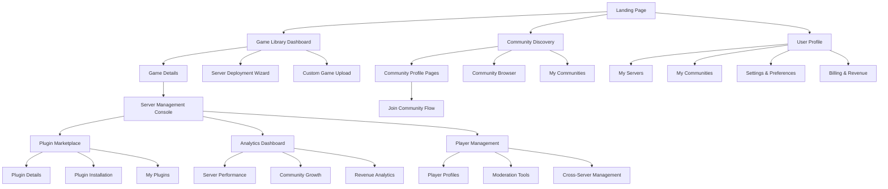
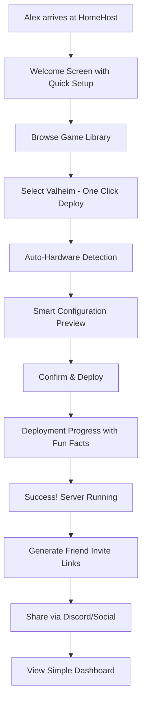
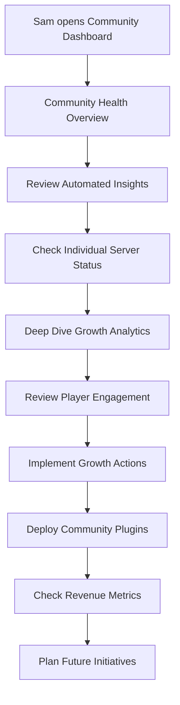
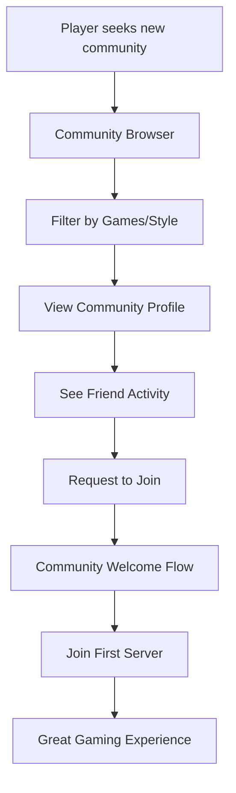

# HomeHost UI/UX Specification

## Introduction

This document defines the user experience goals, information architecture, user flows, and visual design specifications for HomeHost's revolutionary gaming hosting platform. It serves as the foundation for visual design and frontend development, ensuring a cohesive experience that transforms complex hosting into magical, community-driven experiences.

### Overall UX Goals & Principles

### Target User Personas

**Alex - The Casual Host**
- **Profile**: 22-35, non-technical, leads friend groups of 6-12 players
- **Goals**: Host games for friends without technical stress or ongoing costs
- **Success Metric**: Friends playing within 10 minutes of setup decision
- **Design Needs**: Extreme simplicity, clear guidance, confidence-building interactions

**Sam - The Community Builder**  
- **Profile**: 25-45, may have technical background, manages 50-200 member communities
- **Goals**: Build sustainable, profitable multi-game communities with efficient tools
- **Success Metric**: 50% reduction in administrative time, 25% increase in player retention
- **Design Needs**: Powerful tools, unified management, growth analytics, revenue insights

### Usability Goals

**Ease of Learning**: Alex can deploy his first server within 10 minutes without reading documentation
**Efficiency of Use**: Sam can manage multiple servers across games from unified dashboards with minimal clicks
**Error Prevention**: Smart defaults and guided workflows prevent common hosting mistakes and technical failures
**Memorability**: Returning users immediately understand interface patterns and can accomplish goals without relearning
**Delight Factor**: Hosting feels like using premium consumer apps rather than enterprise server management tools

### Design Principles

1. **Community Over Technology** - Lead with social features and community value, not technical specifications
2. **Progressive Disclosure** - Show only what's needed for current task, with clear paths to advanced features
3. **Gaming Culture Native** - Visual language and interactions that feel authentic to gaming communities  
4. **Mobile-First Management** - Critical functions work seamlessly on any device, anywhere
5. **Confidence Through Clarity** - Every interaction builds user confidence with clear feedback and guidance

### Change Log

| Date | Version | Description | Author |
| :--- | :------ | :---------- | :----- |
| Today | 1.0 | Initial UI/UX specification | Sally (UX Expert) |

## Information Architecture (IA)

### Site Map / Screen Inventory

### Navigation Structure

**Primary Navigation**: Context-aware navigation that adapts based on user role and current server status
- **For Alex**: Game Library, My Servers, Help
- **For Sam**: Dashboard, Communities, Analytics, Marketplace

**Secondary Navigation**: Action-specific navigation within major sections
- Server management: Status, Players, Settings, Plugins, Analytics
- Community management: Overview, Servers, Members, Revenue, Growth

**Breadcrumb Strategy**: Clear hierarchy navigation with server/community context always visible

## User Flows

### Alex's First Server Deployment Flow

**User Goal**: Deploy a Valheim server for friends within 10 minutes

**Entry Points**: Landing page, friend referral link, Steam integration

**Success Criteria**: Server running with shareable invite link generated

#### Flow Diagram

**Edge Cases & Error Handling:**
- Hardware insufficient: Suggest optimal player count with explanation
- Port forwarding issues: Automated UPnP with fallback guided setup
- Steam authentication problems: Clear troubleshooting with visual guides
- Friend connection problems: Network diagnostics with one-click fixes

**Notes**: Focus on celebration and confidence building at each success point

### Sam's Community Management Flow

**User Goal**: Monitor and optimize multi-game community across 3 servers

**Entry Points**: Community dashboard, mobile app notifications, analytics alerts

**Success Criteria**: Identify growth opportunities and implement improvements

#### Flow Diagram

**Edge Cases & Error Handling:**
- Server performance issues: Automatic optimization suggestions with one-click fixes
- Community growth stagnation: Data-driven recommendations with implementation guides
- Player behavior problems: Advanced moderation tools with escalation workflows
- Revenue optimization: A/B testing suggestions with automated tracking

### Community Discovery and Joining Flow

**User Goal**: Find and join interesting gaming communities

**Entry Points**: Community browser, friend recommendations, social media links

**Success Criteria**: Successfully joined community and connected with first server

#### Flow Diagram

**Edge Cases & Error Handling:**
- Community full: Waitlist with estimated time, alternative suggestions
- Application rejected: Clear feedback with improvement suggestions
- Server connection issues: Automated diagnostics with admin notification
- New player onboarding: Guided tutorial with community mentor matching

## Wireframes & Mockups

**Primary Design Files**: [Design system and detailed wireframes to be created in Figma]

### Key Screen Layouts

#### Game Library Dashboard (Alex's Primary View)

**Purpose**: Netflix-like discovery and one-click deployment for casual hosting

**Key Elements:**
- Hero section with "Deploy Your First Server" CTA
- Game grid with popularity indicators and difficulty ratings
- Quick filters: Player count, game type, setup time
- Featured community servers for inspiration
- "Friends Playing" social proof section

**Interaction Notes**: Hover states show quick preview with server stats, one-click deploy buttons with progress indication

**Design File Reference**: [Figma frame: Game Library Dashboard]

#### Community Profile Page (Public Discovery)

**Purpose**: Showcase community personality and provide easy joining experience

**Key Elements:**
- Community header with branding, member count, and activity indicators
- Live server status grid with join buttons and player counts
- Community highlights: events, achievements, member spotlights
- Admin contact and community rules quick access
- Social proof: friend activity and member testimonials

**Interaction Notes**: Join buttons adapt based on community type (open/application/invite-only), live status updates

**Design File Reference**: [Figma frame: Community Profile]

#### Server Management Console (Sam's Power Center)

**Purpose**: Comprehensive server management with performance monitoring

**Key Elements:**
- Server status overview with real-time metrics
- Quick action toolbar: restart, backup, update, moderate
- Player list with advanced management options
- Performance graphs with optimization suggestions
- Plugin management panel with marketplace integration

**Interaction Notes**: Contextual actions based on server state, bulk operations for player management

**Design File Reference**: [Figma frame: Server Console]

#### Plugin Marketplace (App Store Experience)

**Purpose**: Discover, install, and manage plugins with consumer app simplicity

**Key Elements:**
- Featured plugins carousel with use case explanations
- Category navigation: QoL, Admin Tools, Community Features
- Plugin cards with ratings, screenshots, and compatibility info
- One-click install with automatic configuration
- "My Plugins" management with update notifications

**Interaction Notes**: Preview functionality shows plugin benefits, installation progress with rollback options

**Design File Reference**: [Figma frame: Plugin Marketplace]

#### Mobile Command Center (Critical Functions)

**Purpose**: Essential server management from mobile devices

**Key Elements:**
- Server status at-a-glance with alert notifications
- Quick actions: player kick/ban, server restart, emergency shutdown
- Community chat integration for admin communication
- Performance alerts with tap-to-fix options
- Friend/player approval workflows

**Interaction Notes**: Swipe gestures for common actions, haptic feedback for critical operations

**Design File Reference**: [Figma frame: Mobile Dashboard]

## Component Library / Design System

**Design System Approach**: Custom design system optimized for gaming communities with professional management capabilities

### Core Components

#### Primary Action Button

**Purpose**: Main call-to-action for deployment, joining, and key workflows

**Variants**: 
- Deploy (gaming-focused gradient with animated icon)
- Join Community (social emphasis with member count)
- Install Plugin (marketplace style with progress states)

**States**: Default, Hover (subtle lift and glow), Loading (animated progress), Success (checkmark celebration), Disabled (clear reasoning)

**Usage Guidelines:**
- Maximum one primary button per view
- Always include contextual icon and clear action verb
- Loading states show progress and estimated time
- Success states celebrate user achievement

#### Community Card Component

**Purpose**: Consistent community representation across discovery and management interfaces

**Variants**:
- Discovery (emphasizes joining and social proof)
- Management (emphasizes status and admin actions)  
- Featured (larger format with video preview capability)

**States**: Active (live servers highlighted), Growing (trending indicators), Offline (clear status with last-seen info)

**Usage Guidelines:**
- Always show real-time member count and activity
- Include community personality through custom branding
- Provide quick access to primary community actions
- Display social proof (friends, ratings, activity)

#### Server Status Indicator

**Purpose**: Clear, at-a-glance server health communication

**Variants**: 
- Healthy (green pulse with player count)
- Warning (amber with specific issue description)
- Critical (red with immediate action required)
- Deploying (animated progress with estimated completion)

**States**: Real-time updates with smooth transitions between states

**Usage Guidelines:**
- Include explanatory text for non-technical users
- Provide one-click fixes for common issues
- Show trend data (improving/declining performance)
- Link to detailed diagnostics when needed

#### Plugin Installation Card

**Purpose**: App store-style plugin representation with gaming context

**Variants**:
- Marketplace (discovery focused with ratings and screenshots)
- Installed (management focused with settings and removal)
- Recommended (personalized suggestions with use case explanation)

**States**: Available, Installing (with progress), Installed, Update Available, Needs Configuration

**Usage Guidelines:**
- Lead with user benefit, not technical features
- Show compatibility with user's current setup
- Provide clear installation and removal processes
- Include user reviews and community ratings

## Branding & Style Guide

### Visual Identity

**Brand Guidelines**: Modern gaming aesthetic that balances professional credibility with community warmth

### Color Palette

| Color Type | Hex Code | Usage |
| :--------- | :------- | :---- |
| **Primary** | #6366F1 | Main CTAs, active states, community emphasis |
| **Secondary** | #8B5CF6 | Supporting actions, plugin marketplace, creative elements |
| **Accent** | #10B981 | Success states, server health, positive metrics |
| **Success** | #059669 | Confirmations, successful deployments, growth indicators |
| **Warning** | #D97706 | Cautions, server warnings, optimization suggestions |
| **Error** | #DC2626 | Errors, critical alerts, failed operations |
| **Neutral** | #374151, #6B7280, #9CA3AF, #D1D5DB, #F3F4F6 | Text hierarchy, borders, backgrounds |

### Typography

**Font Families:**
- **Primary**: Inter (clean, modern, excellent readability)
- **Secondary**: JetBrains Mono (code, technical details, server logs)
- **Accent**: Space Grotesk (headers, community names, gaming emphasis)

**Type Scale:**
| Element | Size | Weight | Line Height |
|:--------|:-----|:-------|:------------|
| H1 | 2.25rem (36px) | 700 | 1.2 |
| H2 | 1.875rem (30px) | 600 | 1.3 |
| H3 | 1.5rem (24px) | 600 | 1.4 |
| Body | 1rem (16px) | 400 | 1.6 |
| Small | 0.875rem (14px) | 400 | 1.5 |

### Iconography

**Icon Library**: Lucide React for consistent, modern iconography with gaming-specific custom icons

**Usage Guidelines**: 
- 24px standard size for interface icons
- 16px for inline and compact contexts  
- 32px for primary actions and emphasis
- Gaming-specific icons for servers, communities, and plugins

### Spacing & Layout

**Grid System**: 12-column responsive grid with 24px gutters

**Spacing Scale**: 4px base unit with 8, 12, 16, 24, 32, 48, 64, 96px increments for consistent rhythm

## Accessibility Requirements

### Compliance Target

**Standard**: WCAG 2.1 AA compliance with gaming community considerations

### Key Requirements

**Visual:**
- Color contrast ratios: 4.5:1 for normal text, 3:1 for large text
- Focus indicators: 2px solid outline with high contrast color
- Text sizing: Scalable to 200% without horizontal scrolling

**Interaction:**
- Keyboard navigation: All functionality accessible via keyboard
- Screen reader support: Semantic HTML with proper ARIA labels
- Touch targets: Minimum 44x44px for mobile interactions

**Content:**
- Alternative text: Descriptive alt text for all gaming imagery and charts
- Heading structure: Logical hierarchy with proper nesting
- Form labels: Clear, descriptive labels for all inputs

### Testing Strategy

**Automated Testing**: axe-core integration in CI/CD pipeline
**Manual Testing**: Regular testing with screen readers and keyboard navigation
**User Testing**: Include accessibility considerations in user research

## Responsiveness Strategy

### Breakpoints

| Breakpoint | Min Width | Max Width | Target Devices |
| :--------- | :-------- | :-------- | :------------- |
| Mobile | 320px | 767px | Phones, small tablets |
| Tablet | 768px | 1023px | Tablets, small laptops |
| Desktop | 1024px | 1439px | Laptops, desktop monitors |
| Wide | 1440px | - | Large monitors, gaming setups |

### Adaptation Patterns

**Layout Changes**: 
- Mobile: Single column with collapsible navigation
- Tablet: Hybrid layout with contextual sidebars
- Desktop: Multi-column with persistent navigation
- Wide: Enhanced data density with additional panels

**Navigation Changes**:
- Mobile: Hamburger menu with gesture navigation
- Tablet: Tab bar with contextual actions
- Desktop: Persistent sidebar with breadcrumbs
- Wide: Multi-level navigation with expanded options

**Content Priority**:
- Mobile: Focus on single-task workflows with clear progression
- Tablet: Balanced information density with touch-optimized controls  
- Desktop: Rich data presentation with keyboard shortcuts
- Wide: Maximum information density with advanced features

**Interaction Changes**:
- Mobile: Touch gestures, swipe actions, haptic feedback
- Tablet: Hybrid touch/precision pointing with contextual menus
- Desktop: Keyboard shortcuts, hover states, right-click menus
- Wide: Advanced keyboard navigation, multi-monitor support

## Animation & Micro-interactions

### Motion Principles

**Purposeful Movement**: All animations serve functional purposes - providing feedback, guiding attention, or improving perceived performance
**Gaming-Appropriate Timing**: Slightly faster than typical web apps to match gaming user expectations
**Accessibility Consideration**: Respect prefers-reduced-motion settings with essential motion only

### Key Animations

- **Server Deployment Progress**: Animated progress bar with gaming-themed milestones and estimated completion
- **Community Member Count**: Smooth number transitions with subtle celebration effects for growth
- **Plugin Installation**: Progress indication with preview of plugin benefits during installation
- **Success Celebrations**: Satisfying completion animations for major accomplishments (first server, community join)
- **Status Transitions**: Smooth color and icon transitions for server health changes
- **Mobile Gestures**: Clear visual feedback for swipe actions and touch interactions

## Performance Considerations

### Performance Goals

- **Page Load**: <2 seconds for dashboard on 3G connections
- **Interaction Response**: <100ms for common actions, <16ms for animations
- **Gaming Context**: Minimize impact on game performance when managing servers

### Design Strategies

**Optimized Assets**: 
- WebP images with fallbacks for maximum compatibility
- SVG icons for crisp display at all resolutions
- Lazy loading for community images and non-critical content

**Efficient Interactions**:
- Skeleton screens during data loading
- Optimistic UI updates with rollback on failure
- Progressive enhancement for advanced features

**Gaming Performance**:
- Background operation modes to minimize resource usage
- Performance impact warnings for resource-intensive operations
- Option to pause monitoring during active gaming sessions

## Next Steps

### Immediate Actions

1. **Create detailed wireframes** in Figma for all key screen layouts
2. **Develop interactive prototypes** for critical user flows (deployment, community joining)
3. **Design component library** with full gaming-appropriate styling

### Design Handoff Checklist

- [ ] Complete wireframes for all major user flows
- [ ] Component library with full state definitions
- [ ] Responsive behavior specifications for all breakpoints
- [ ] Animation timing and easing specifications
- [ ] Accessibility compliance verification
- [ ] Performance optimization guidelines

## Checklist Results

[UI/UX validation checklist results to be populated]